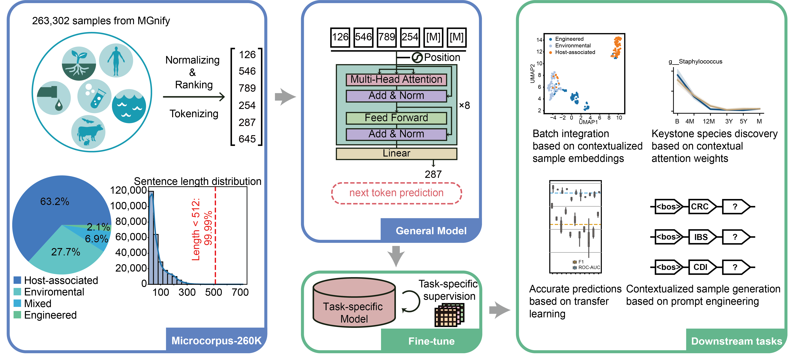

# MGM

**Microbial General Model (MGM)** is a large-scale pretrained language model designed for interpretable microbiome data analysis. MGM allows for fine-tuning and evaluation across various microbiome data analysis tasks.



## Installation

### By pip

```bash
pip install microformer-mgm
```

### By source
Install the MGM package using `setup.py`:

```bash
python setup.py install
```

## Usage

MGM can be utilized via the command line interface (CLI) with different modes. The general syntax is:

```bash
mgm <mode> [options]
```

### Available Modes

#### `construct`
Converts input abundance data to a count matrix at the Genus level, normalizes it using phylogeny, and constructs a microbiome corpus. The corpus represents each sample as a sentence from high rank genus to low rank genus.

**Input:** Data in hdf5, csv, or tsv format (features in rows, samples in columns)  
**Output:** A pkl file containing the microbiome corpus

**Example:**

```bash
mgm construct -i infant_data/abundance.csv -o infant_corpus.pkl
```

> For hdf5 files, specify the key using `-k` (default key is `genus`).

#### `pretrain`
Pretrains the MGM model using the microbiome corpus in a GPT-style manner. Optionally, you can train the generator by providing a label file. If the label file is provided, the tokenized label will be added following the \<bos> token, meanwhile, the tokenizer will be updated and the model's embedding layer will be expanded.

**Input:** Corpus from `construct` mode  
**Output:** Pretrained MGM model

**Examples:**

```bash
mgm pretrain -i infant_corpus.pkl -o infant_model
mgm pretrain -i infant_corpus.pkl -l infant_data/meta_withbirth.csv -o infant_model_gen --with-label
```

> Use `--from-scratch` to train the model from scratch instead of loading pretrained weights.

#### `train`
Trains a supervised MGM model without mask pretrained weights, requiring labeled data.

**Input:** Corpus from `construct` mode, label file (csv)  
**Output:** Supervised MGM model

**Example:**

```bash
mgm train -i infant_corpus.pkl -l infant_data/meta_withbirth.csv -o infant_model_clf
```

#### `finetune`
Finetunes the MGM model to fit a new task, using labeled data and optionally a customized MGM model.

**Input:** Corpus from `construct` mode, label file (csv), pretrained model (optional)  
**Output:** Finetuned MGM model

**Example:**

```bash
mgm finetune -i infant_corpus.pkl -l infant_data/meta_withbirth.csv -m infant_model -o infant_model_clf_finetune
```

#### `predict`
Predicts labels of input data using the expert model. If a label file is provided, prediction results will be compared with the ground truth using various metrics.

**Input:** Corpus from `construct` mode, label file (optional), supervised MGM model  
**Output:** Prediction results in csv format

**Example:**

```bash
mgm predict -E -i infant_corpus.pkl -l infant_data/meta_withbirth.csv -m infant_model_clf -o infant_prediction.csv
```

#### `generate`
Generates synthetic microbiome data using the pretrained MGM model. A prompt file is required for generating samples with specific labels.

**Input:** Pretrained MGM model  
**Output:** Synthetic genus tensors in pickle format

**Example:**

```bash
mgm generate -m infant_model_clf -p infant_data/prompt.txt -n 100 -o infant_synthetic.pkl
```

#### `reconstruct`
Reconstruct abundance from ranked corpus. 
                                        
**Input:**  Abundance file for train reconstructor or trained model in ckpt; Ranked corpus for reconstruct; Get label's tokenizer in generator if there is; Prompt if there is label in corpus

**Output:**  Reconstructed corpus ; Reconstructor model; Decoded label

```bash
mgm reconstruct -a infant_data/abundance.csv -i infant_generate.pkl -g infant_model_generate -w True -o reconstructor_file 
mgm reconstruct -r reconstructor_file/reconstructor_model.ckpt -i infant_generate.pkl -g infant_model_generate -w True -o reconstructor_file 
```

For detailed usage of each mode, refer to the help message:

```bash
mgm <mode> --help
```

## Maintainers
| Name | Email | Organization |
| ---- | ----- | ------------ |
|Haohong Zhang|[haohongzh@gmail.com](mailto:haohongzh@gmail.com)|PhD Student, School of Life Science and Technology, Huazhong University of Science & Technology|
|Zixin Kang| [29590kang@gmail.com](mailto:29590kang@gmail.com)| Undergraduate, School of Life Science and Technology, Huazhong University of Science & Technology|
|Kang Ning  | [ningkang@hust.edu.cn](mailto:ningkang@hust.edu.cn)       | Professor, School of Life Science and Technology, Huazhong University of Science & Technology |
